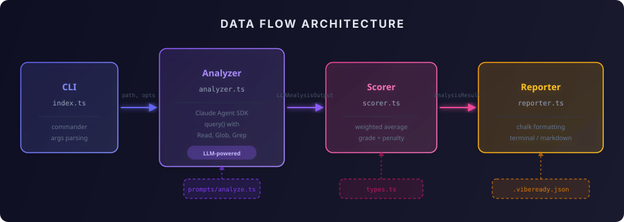
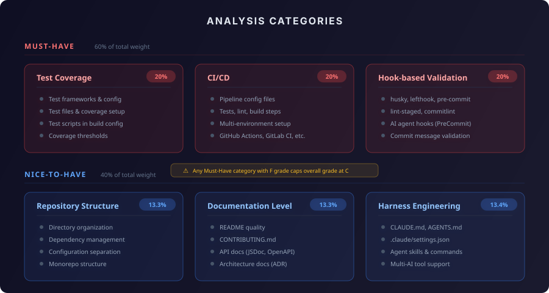

> 🇰🇷 [한국어 버전](README.ko.md)

# vibe-ready

[](https://www.npmjs.com/package/vibe-ready)
[](https://github.com/roboco-io/vibe-ready-cli/actions/workflows/ci.yml)
[](https://opensource.org/licenses/MIT)
[](https://nodejs.org)
[](https://www.typescriptlang.org)
[](https://www.npmjs.com/package/vibe-ready)

A CLI tool that analyzes how ready a repository is for vibe coding (AI agent-based development).

Using the Claude Agent SDK, an LLM directly explores the repository, scores it across 7 categories, and provides an overall grade along with specific improvement recommendations. Commit-log stats (issue reference rate, PR workflow patterns) are pre-extracted and injected into the analysis prompt before the LLM call.

## Installation & Usage

### Quick Start (via npm)

```bash
# Run directly without installation
npx vibe-ready .

# Or install globally
npm install -g vibe-ready

# Then use anywhere
vibe-ready /path/to/repo
vibe-ready . --verbose
vibe-ready . --markdown
vibe-ready . --pdf report.pdf
vibe-ready . --category "하네스 엔지니어링"
```

> **Prerequisite**: [Claude Code](https://claude.ai/code) must be installed and authenticated. The Claude Agent SDK uses your Claude Code subscription — no separate API key required.

### For Developers (from source)

```bash
git clone https://github.com/roboco-io/vibe-ready-cli.git
cd vibe-ready-cli
npm install
npm run build

# Run from source
node dist/index.js /path/to/repo
node dist/index.js . --verbose --markdown
node dist/index.js . --pdf report.pdf --verbose

# Run tests
npm test
```

### CLI Options

| Option | Default | Description |
|--------|---------|-------------|
| `[path]` | `.` | Path to the repository to analyze |
| `-v, --verbose` | - | Show detailed analysis findings |
| `-m, --markdown` | - | Output in Markdown format |
| `-c, --category <names>` | all | Analyze specific categories only (comma-separated) |
| `-b, --branch <branches>` | current | Analyze specific branches (comma-separated, with comparison report) |
| `-o, --output <file>` | - | Save report to file (.md extension auto-detected) |
| `--pdf <file>` | - | Export report as PDF (requires pandoc + xelatex) |
| `--no-cache` | - | Skip cache and force fresh analysis |
| `--max-turns <n>` | `200` | Max LLM agent turns |
| `--max-budget <n>` | `0.50` | Max budget in USD per analysis |
| `--timeout <n>` | `120` | Timeout in seconds |

## Architecture

<p align="center">
  
</p>

## Analysis Categories

<p align="center">
  
</p>

### Must-Have — Verification First
| Category | Weight | What's Analyzed |
|----------|--------|-----------------|
| Test Coverage | 20% | Test configuration, test files, coverage setup, test scripts |
| CI/CD | 20% | GitHub Actions, GitLab CI, and other pipeline configurations and contents |
| Hook-based Validation | 20% | husky, lint-staged, pre-commit, commitlint, etc. |

### Nice-to-Have
| Category | Weight | What's Analyzed |
|----------|--------|-----------------|
| Repository Structure | 10% | Directory organization, dependency management, configuration separation |
| Documentation Level | 10% | README, CONTRIBUTING, API docs, architecture docs |
| Harness Engineering | 10% | CLAUDE.md, AGENTS.md, .claude/settings.json, skills, commands, multi-AI tool support |
| Issue Tracking Integration | 10% | Issue reference rate in commits (GitHub #N / Jira ABC-123), PR workflow patterns |

## Configuration

Create a `.vibeready.json` in your repo root to customize evaluation:

```json
{
  "categories": [
    { "name": "Test Coverage", "tier": "must", "weight": 0.25 },
    { "name": "CI/CD", "tier": "must", "weight": 0.25 },
    { "name": "Security", "tier": "must", "weight": 0.20,
      "description": "Evaluate repository security settings",
      "checkpoints": [
        ".env is in .gitignore",
        "No hardcoded secrets in source code",
        "Dependency vulnerability scanning configured"
      ]
    },
    { "name": "Documentation", "tier": "nice", "weight": 0.15 },
    { "name": "Harness Engineering", "tier": "nice", "weight": 0.15 }
  ],
  "penaltyRule": {
    "enabled": true,
    "maxGrade": "C",
    "condition": "any must-have category F"
  }
}
```

- Override default category weights and tiers
- Add custom categories with `description` and `checkpoints`
- Weights are auto-normalized if they don't sum to 1.0
- Supported filenames: `.vibeready.json`, `.vibeready.config.json`, `vibeready.config.json`
- See [.vibeready.example.json](.vibeready.example.json) for a full example

## Output Example

```
═══════════════════════════════════════════════════
  🎵 Vibe Ready Score
═══════════════════════════════════════════════════

  Overall Score: 72 / 100  Grade: C

  Results by Category
  ─────────────────────────────────────────────────
  Category               Type      Score    Grade
  ─────────────────────────────────────────────────
  Test Coverage          Must      85       B
  CI/CD                  Must      90       A
  Hook-based Validation  Must      45       F
  Repository Structure   Nice      80       B
  Documentation Level    Nice      70       C
  Harness Engineering     Nice      60       D
  Issue Tracking Integration Nice   75       C
  ─────────────────────────────────────────────────

  ⚠ Must-Have category F grade: Hook-based Validation → Overall grade capped at C

  Recommendations
  ✖ [Hook-based Validation] pre-commit hook is not configured
    → Install husky and configure lint-staged
```

## Scoring Model

- Each category: 0–100 points
- Overall score: weighted average (Must-Have 60%, Nice-to-Have 40%)
- Grades: A(90+), B(80+), C(70+), D(50+), F(<50)
- **Penalty**: If any Must-Have category receives an F, the overall grade is capped at C

## CLI Options

| Option | Default | Description |
|--------|---------|-------------|
| `[path]` | `.` | Path to the repository to analyze |
| `-v, --verbose` | - | Show detailed analysis results (rawFindings) |
| `--max-turns <n>` | `200` | Maximum number of LLM agent turns |
| `--max-budget <n>` | `0.50` | Maximum cost per analysis run (USD) |
| `--timeout <n>` | `120` | Timeout (seconds) |

## Known Limitations

- **LLM non-determinism**: Repeated analysis of the same repo may vary by ±5–10 points
- **Estimated cost**: Approximately $0.10–0.50 per analysis run (varies by repo size)
- **Read-Only analysis**: The target repository is never modified
- **MVP limitations**: Currently supports single repo + terminal output only. JSON/HTML output and batch analysis are planned for future versions

## Development

```bash
npm install
npm run build
npm test
```

## Tutorial

The entire process of building this project has been documented as a vibe coding tutorial:

**[Vibe Coding Tutorial](docs/vibe-coding-tutorial/README.md)** — 5 chapters, from idea → deep interview → implementation → harness engineering → contribution framework

| Chapter | Duration | Key Content |
|---------|----------|-------------|
| 01. Idea & Initialization | ~10 min | Ideation doc, /init |
| 02. Deep Interview | ~25 min | 10-round Q&A, ambiguity 100%→19% |
| 03. MVP Implementation | ~40 min | 5 modules based on Claude Agent SDK |
| 04. Harness Engineering | ~15 min | CLAUDE.md, AGENTS.md, settings.json |
| 05. Contribution Guide + Skills | ~10 min | CONTRIBUTING.md, contribution-guard skill |

## Harness Engineering

This project applies **harness engineering** so that AI agents (such as Claude Code) can effectively understand and work with the codebase.

### Components

| File | Role |
|------|------|
| `CLAUDE.md` | Core context for agents to understand the project — tech stack, build commands, architecture, data flow, scoring rules, coding conventions |
| `AGENTS.md` | Agent working guidelines — module structure, test/commit rules, extension points, prohibited actions |
| `.claude/settings.json` | Agent permissions and hook configuration — allowed tools, PreCommit auto-validation (build+test) |

### Design Principles

- **Immediately graspable context**: `CLAUDE.md` is written so agents can understand the project structure, build process, and architecture on their first turn
- **Safe autonomous operation**: `.claude/settings.json` auto-allows only read tools and build/test commands, enabling agents to explore and verify autonomously without destructive behavior
- **Pre-commit auto-validation**: A PreCommit hook enforces `npm run build && npm test`, preventing agents from committing broken code
- **Built-in extension guide**: `AGENTS.md` specifies how to add new check modules, output formats, CI gate modes, and more, so agents can add features following consistent patterns

### Deep Interview-based Context Collection

To reduce requirement ambiguity in the early stages of the project, a **deep interview** was conducted. Through 10 rounds of structured Q&A, goals, constraints, and acceptance criteria were clarified. The results are preserved in `.omc/specs/deep-interview-*.md` and used as context for subsequent work.

## License

MIT
